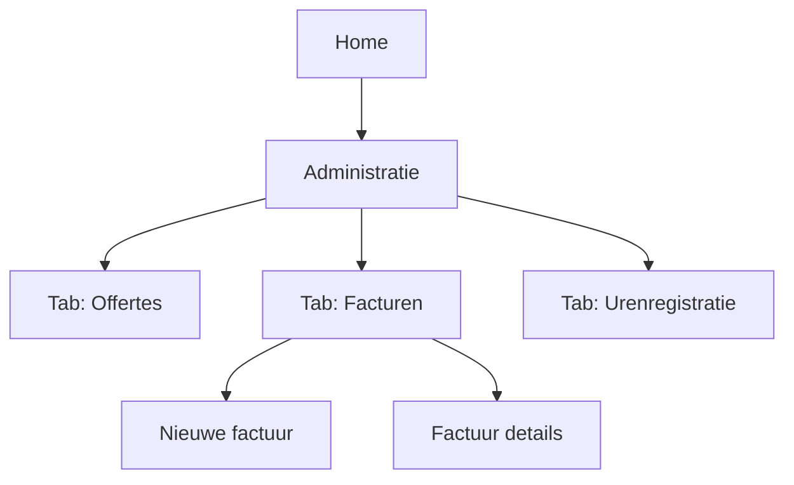

## 1. Product Overview
Uitbreiding van de sectie **Administratie** met drie tabbladen: **Offertes**, **Facturen** en **Urenregistratie**.
Doel: administratie-workflows (offertes → facturen → uren) overzichtelijk beheren vanuit één plek.

## 2. Core Features

### 2.1 Feature Module
Onze administratie-uitbreiding bestaat uit de volgende hoofdpagina’s:
1. **Home**: primaire navigatie, snelle link naar Administratie.
2. **Administratie**: tabbladen Offertes / Facturen / Urenregistratie met tab-specifieke lijsten en acties.

### 2.3 Page Details
| Page Name | Module Name | Feature description |
|-----------|-------------|---------------------|
| Home | Hoofdnavigatie | Toon vaste navigatie met item **Administratie** en snelle toegang naar het laatste gebruikte tabblad. |
| Administratie | Tab-navigatie | Toon tabbladen **Offertes**, **Facturen**, **Urenregistratie** en onthoud laatst geselecteerde tab. |
| Administratie (Offertes) | Offerte-overzicht | Toon lijst van offertes met basisgegevens (datum, klant, bedrag, status) en primaire actie om een offerte te openen. |
| Administratie (Facturen) | Facturen-toolbar | Toon paginatitel **Facturen**, zoekveld, statusfilter, en primaire CTA **Nieuwe factuur**. |
| Administratie (Facturen) | Facturen-tabel | Toon tabel met facturen (zoals in UI): datum, factuurnummer, klant, omschrijving, bedrag, status en acties per rij. |
| Administratie (Facturen) | Factuur-acties | Laat per factuur rij-acties uitvoeren (openen/bekijken, bewerken indien concept, downloaden/printen, verwijderen) via knoppen of contextmenu. |
| Administratie (Facturen) | Sorteren & pagineren | Laat sorteren op kernkolommen (minimaal datum en factuurnummer) en toon paginering onderaan. |
| Administratie (Urenregistratie) | Urenoverzicht | Toon lijst van geregistreerde uren met basisgegevens (datum, medewerker/naam, project/klant, aantal uren) en primaire actie om een registratie te openen. |

## 3. Core Process
**Standaard flow**
1. Je opent **Home** en navigeert naar **Administratie**.
2. In **Administratie** kies je het gewenste tabblad: **Offertes**, **Facturen** of **Urenregistratie**.
3. In **Facturen** zoek/filter je facturen, open je een factuur, of maak je een **Nieuwe factuur** aan.
4. Je beheert een factuur via rij-acties (bijv. bekijken/bewerken/downloaden/verwijderen) en navigeert door pagina’s via paginering.

