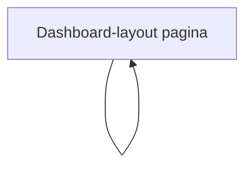

## 1. Product Overview
Je wil dat de huidige site qua styling en layout overeenkomt met de meegeleverde screenshot.
Focus: dashboard-achtige layout met sidebar, topbar, cards, kleuren en typografie.

## 2. Core Features

### 2.1 Feature Module
De minimale UI-requirements bestaan uit de volgende pagina:
1. **Dashboard-layout pagina**: vaste sidebar, topbar met zoekveld/acties, content met card-grid en consistente typografie/kleuren.

### 2.2 Page Details
| Page Name | Module Name | Feature description |
|-----------|-------------|---------------------|
| Dashboard-layout pagina | App shell (layout) | Toon vaste sidebar links + topbar bovenin + scrollbare content area, met consistente spacing en grid. |
| Dashboard-layout pagina | Sidebar navigation | Toon logo/brand en navigatie-items met hover/active states; support collapsed/expanded state (optioneel). |
| Dashboard-layout pagina | Topbar | Toon paginatitel, zoekveld, en rechts ruimte voor user/acties; blijft sticky bij scroll. |
| Dashboard-layout pagina | Card grid | Toon cards in responsive grid met titel/waarde/subtekst; consistente borders, radius en schaduwen. |
| Dashboard-layout pagina | UI theming | Pas kleuren, typografie, iconstijl en component states toe zodat het visueel matcht met de screenshot. |

## 3. Core Process
Gebruikersflow:
- Je opent de site en ziet een dashboard-layout met sidebar links.
- Je gebruikt de sidebar om tussen secties te navigeren (UI staat en active item blijven zichtbaar).
- Je gebruikt de topbar (zoekveld/acties) terwijl de content in de hoofdsectie scrolt.

