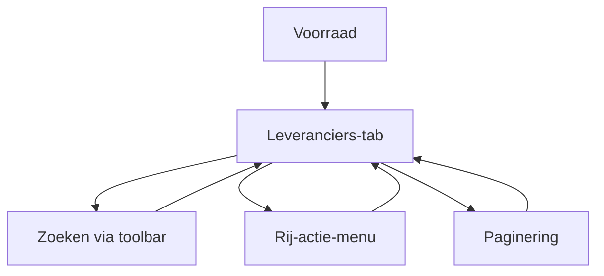

## 1. Product Overview
De Leveranciers-tab in Voorraad biedt een overzicht van leveranciers en laat je leveranciers beheren.
De tab is visueel en interactioneel gelijk aan het aangeleverde screenshot (header, acties, toolbar, tabel, paginering).

## 2. Core Features

### 2.1 Feature Module
De requirements voor deze tab bestaan uit de volgende onderdelen:
1. **Leveranciers (Voorraad) – Header**: paginatitel en context.
2. **Leveranciers (Voorraad) – Acties**: primaire acties rechtsboven.
3. **Leveranciers (Voorraad) – Toolbar**: zoeken en basisbediening boven de tabel.
4. **Leveranciers (Voorraad) – Tabel**: lijstweergave met rijen, kolommen en rij-acties.
5. **Leveranciers (Voorraad) – Paginering**: navigatie door meerdere pagina’s resultaten.

### 2.3 Page Details
| Page Name | Module Name | Feature description |
|-----------|-------------|---------------------|
| Voorraad – Leveranciers | Header | Toon paginatitel “Leveranciers” in dezelfde stijl als screenshot. |
| Voorraad – Leveranciers | Acties | Toon primaire actieknop(pen) rechtsboven (zoals in screenshot) om een leverancier toe te voegen en eventuele secundaire actie(s) als aparte knop. |
| Voorraad – Leveranciers | Toolbar | Bied een zoekveld (placeholder/styling gelijk aan screenshot) om leveranciers te filteren op basis van zichtbare velden. |
| Voorraad – Leveranciers | Tabel – kolommen | Toon tabel met kolomheaders conform screenshot (zelfde volgorde, alignment en header-styling). |
| Voorraad – Leveranciers | Tabel – rijen | Toon leveranciers als rijen; elke rij volgt dezelfde typografie, spacing en hover/selected states als screenshot. |
| Voorraad – Leveranciers | Tabel – rij-acties | Toon per rij een “meer”/actie-menu (icoon) op de meest rechtse positie, visueel gelijk aan screenshot. |
| Voorraad – Leveranciers | Tabel – lege/geen resultaten | Toon een lege staat wanneer er geen leveranciers zijn of wanneer zoeken geen resultaten oplevert, zonder layout te breken. |
| Voorraad – Leveranciers | Paginering | Toon paginering onder de tabel (positie en stijl gelijk aan screenshot), inclusief huidige pagina en navigatie naar vorige/volgende pagina. |

## 3. Core Process
**Standaard flow (beheer in lijst):**
1. Je opent Voorraad en kiest de tab “Leveranciers”.
2. Je ziet de header met acties en daaronder de toolbar en tabel.
3. Je zoekt via de toolbar; de tabel filtert de zichtbare leveranciers.
4. Je navigeert door resultaten via paginering.
5. Je gebruikt het rij-actie-menu om een leverancier te beheren.

