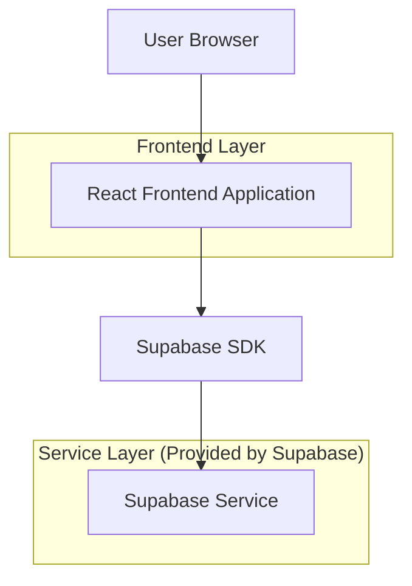
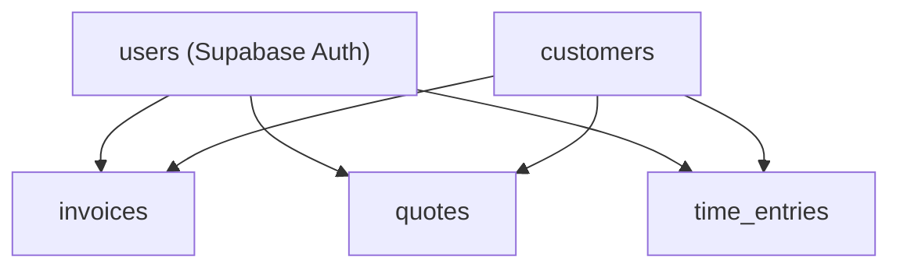

## 1.Architecture design


## 2.Technology Description
- Frontend: React@18 + tailwindcss@3 + vite
- Backend: Supabase (Auth + Postgres + Storage optioneel)

## 3.Route definitions
| Route | Purpose |
|-------|---------|
| / | Home, navigatie naar Administratie |
| /administratie | Administratie met tabbladen Offertes/Facturen/Urenregistratie (via interne tabs of query `?tab=`) |

## 6.Data model(if applicable)

### 6.1 Data model definition


### 6.2 Data Definition Language
Customers (customers)
```sql
CREATE TABLE customers (
  id UUID PRIMARY KEY DEFAULT gen_random_uuid(),
  owner_user_id UUID NOT NULL,
  name TEXT NOT NULL,
  email TEXT,
  created_at TIMESTAMPTZ DEFAULT NOW(),
  updated_at TIMESTAMPTZ DEFAULT NOW()
);

CREATE INDEX idx_customers_owner_user_id ON customers(owner_user_id);
```

Offertes (quotes)
```sql
CREATE TABLE quotes (
  id UUID PRIMARY KEY DEFAULT gen_random_uuid(),
  owner_user_id UUID NOT NULL,
  customer_id UUID NOT NULL,
  quote_number TEXT NOT NULL,
  date DATE NOT NULL,
  description TEXT,
  amount_cents INTEGER NOT NULL DEFAULT 0,
  currency TEXT NOT NULL DEFAULT 'EUR',
  status TEXT NOT NULL DEFAULT 'concept' CHECK (status IN ('concept','verzonden','geaccepteerd','afgewezen')),
  created_at TIMESTAMPTZ DEFAULT NOW(),
  updated_at TIMESTAMPTZ DEFAULT NOW()
);

CREATE INDEX idx_quotes_owner_user_id ON quotes(owner_user_id);
CREATE INDEX idx_quotes_customer_id ON quotes(customer_id);
CREATE UNIQUE INDEX idx_quotes_owner_number_unique ON quotes(owner_user_id, quote_number);
```

Facturen (invoices)
```sql
CREATE TABLE invoices (
  id UUID PRIMARY KEY DEFAULT gen_random_uuid(),
  owner_user_id UUID NOT NULL,
  customer_id UUID NOT NULL,
  invoice_number TEXT NOT NULL,
  date DATE NOT NULL,
  description TEXT,
  amount_cents INTEGER NOT NULL DEFAULT 0,
  currency TEXT NOT NULL DEFAULT 'EUR',
  status TEXT NOT NULL DEFAULT 'concept' CHECK (status IN ('concept','verzonden','betaald','vervallen','gecrediteerd')),
  created_at TIMESTAMPTZ DEFAULT NOW(),
  updated_at TIMESTAMPTZ DEFAULT NOW()
);

CREATE INDEX idx_invoices_owner_user_id ON invoices(owner_user_id);
CREATE INDEX idx_invoices_customer_id ON invoices(customer_id);
CREATE UNIQUE INDEX idx_invoices_owner_number_unique ON invoices(owner_user_id, invoice_number);
```

Urenregistratie (time_entries)
```sql
CREATE TABLE time_entries (
  id UUID PRIMARY KEY DEFAULT gen_random_uuid(),
  owner_user_id UUID NOT NULL,
  customer_id UUID,
  entry_date DATE NOT NULL,
  description TEXT,
  minutes INTEGER NOT NULL DEFAULT 0,
  created_at TIMESTAMPTZ DEFAULT NOW(),
  updated_at TIMESTAMPTZ DEFAULT NOW()
);

CREATE INDEX idx_time_entries_owner_user_id ON time_entries(owner_user_id);
CREATE INDEX idx_time_entries_customer_id ON time_entries(customer_id);
CREATE INDEX idx_time_entries_entry_date ON time_entries(entry_date DESC);
```

Aanbevolen permissies (hoog niveau)
```sql
-- Voor administratie-data: alleen voor ingelogde gebruikers.
GRANT ALL PRIVILEGES ON customers TO authenticated;
GRANT ALL PRIVILEGES ON quotes TO authenticated;
GRANT ALL PRIVILEGES ON invoices TO authenticated;
GRANT ALL PRIVILEGES ON time_entries TO authenticated;

-- Optioneel: geen anon toegang voor privacy-gevoelige data.
REVOKE ALL ON customers FROM anon;
REVOKE ALL ON quotes FROM anon;
REVOKE ALL ON invoices FROM anon;
REVOKE ALL ON time_entries FROM anon;
```
