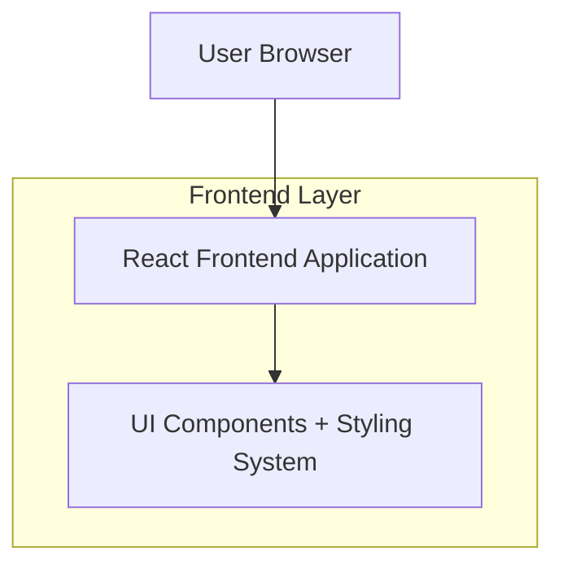

## 1.Architecture design

## 2.Technology Description
- Frontend: React@18 + vite + tailwindcss@3 (of CSS Modules) + TypeScript
- Backend: None (niet nodig voor styling/layout)

## 3.Route definitions
| Route | Purpose |
|-------|---------|
| / | Dashboard-layout pagina met sidebar/topbar/cards |
