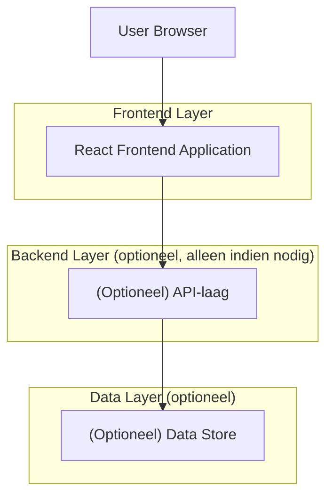

## 1.Architecture design

## 2.Technology Description
- Frontend: React@18 + TypeScript + (bestaande design system / CSS framework)
- Backend: None (tab kan volledig client-side met bestaande data-bron werken)

## 3.Route definitions
| Route | Purpose |
|-------|---------|
| /voorraad | Hoofdpagina Voorraad met tabs, inclusief Leveranciers-tab |

## 4.API definitions (If it includes backend services)
Niet van toepassing (geen backend gespecificeerd voor deze notitie).

## 5.Server architecture diagram (If it includes backend services)
Niet van toepassing.

## 6.Data model(if applicable)
Niet van toepassing (datamodel is niet gevraagd en niet gespecificeerd).
